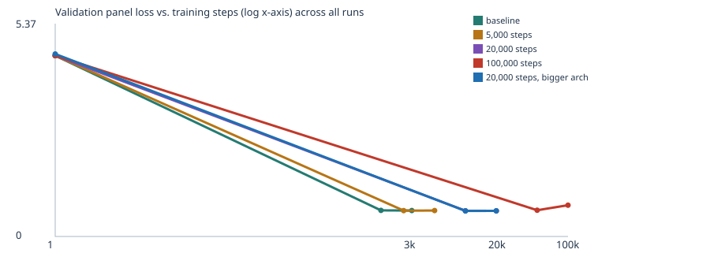

# Extended experiments: more steps, bigger model — does it get "smarter"?

My professor asked me to push past the required 3,000-step baseline: train for longer, try a
bigger model, and see how much "smarter" the model actually becomes. This is optional,
supplementary work on top of the required submission in [README.md](README.md) — it doesn't
replace it. All settings below are variations on the same notebook (`custom_llm.py`, the
script-mirror of `custom_llm.ipynb`), changing exactly one variable per run.

**Runs**, all on the same synthetic classroom corpus (4,632 unique passages, seed 42, CPU,
learning rate 0.001, warmup + cosine decay):

| Run | Steps | Params | Elapsed | Final train loss | Final val loss |
|---|---|---|---|---|---|
| Baseline (required submission) | 3,000 | 111,872 | 9.7s | 0.6956 | **0.7057** |
| More steps | 5,000 | 111,872 | 13.7s | 0.6976 | **0.7068** |
| More steps | 20,000 | 111,872 | 55.4s | 0.6859 | **0.6969** |
| More steps | 100,000 | 111,872 | 317.0s (5m17s) | 0.6860 | **0.8523** |
| Bigger model (4 blocks, 8 heads, 128-dim, 64-token context) | 20,000 | 818,944 (7.3x) | 197.2s | 0.6851 | **0.6976** |

Full artifacts for each run: [experiments/steps5k/](experiments/steps5k/),
[experiments/steps20k/](experiments/steps20k/), [experiments/steps100k/](experiments/steps100k/),
[experiments/bigarch20k/](experiments/bigarch20k/) — same file set as the baseline's
[evidence/](evidence/) folder (`history.json`, `config.json`, `checkpoint.json`, `model.pt`,
`samples/`, `training_curves.svg`, etc.). The scripts that generated these
(`experiments/run_experiment.py`, `experiments/run_all.sh`) are included for reproducibility.



## Does more training make it "smarter"?

**No, not past a point — and it can make things worse.** Validation loss drops from 0.706
(3k steps) to 0.697 (20k steps), a small real improvement, then **rises to 0.852 at 100k
steps** while training loss stays essentially flat (0.686). That's the textbook signature of
overfitting: past ~20,000 steps the model keeps sharpening its fit to the training panel
without generalizing any further — the validation panel actively gets worse. On this narrow,
7-template corpus, more training budget does not straightforwardly mean a better model.

More strikingly: **the generated samples barely change at all past step 1,500**, in any of
the five runs. Every run — 3k, 5k, 20k, even 100k steps — converges to the same handful of
sentences (e.g. *"our school has a question about the new educator and lesson."*, *"the
consumer compared the merchandise after checking the price."*, with only minor word swaps like
"tutor" vs "educator" or "ordered" vs "compared"). If you only looked at generated text, you
would have no way to tell the 3,000-step run from the 100,000-step run apart — even though
their measured validation losses differ by 0.15 (0.706 vs 0.852). This is a useful reminder
that eyeballing samples is a weak way to judge "smartness"; the numbers can diverge sharply
while the small, fixed set of outputs the model tends to produce looks the same.

## Does a bigger model make it "smarter"?

**Not on this corpus.** The bigger architecture (4 blocks instead of 2, 8 heads instead of 4,
128-dim embeddings instead of 64, 7.3x the parameters) reaches essentially the same validation
loss at 20,000 steps as the small model at 20,000 steps (0.6976 vs 0.6969 — a difference smaller
than the run-to-run noise already visible between the 5k and 20k small-model runs). Extra
capacity doesn't buy a better fit, because the bottleneck here isn't the model — it's the
**data**. The corpus only contains ~7 sentence templates over a 133-word vocabulary; both
models have more than enough capacity to fully represent that, so adding parameters has nothing
left to spend itself on. A bigger model would only start to pay off with a bigger, more varied
corpus for it to actually need the extra capacity to represent.

## What about the learned embeddings?

I checked `customer`'s nearest neighbors (by cosine similarity over the full 64- or 128-number
vector) across all five runs:

| Run | Top-5 nearest neighbors of "customer" | Top similarity |
|---|---|---|
| Baseline (3k) | client, buyer, subscriber, consumer, shopper | 0.985 |
| 5k steps | client, buyer, consumer, subscriber, shopper | 0.990 |
| 20k steps | consumer, client, buyer, shopper, subscriber | 0.696 |
| 100k steps | client, consumer, buyer, shopper, subscriber | 0.902 |
| Bigger arch, 20k | buyer, shopper, consumer, client, subscriber | 0.786 |

The **set** of neighbors is identical (the same 5 retail-context words) in every single run,
regardless of step count or model size — that grouping is learned almost immediately and stays
stable. But the **similarity values** bounce around (0.70–0.99) without a clear trend tied to
more training or a bigger model. That tells me the categorical structure (which words share a
sentence slot) is the easy, fast part for this tiny model to learn, while the exact geometry of
the embedding space is noisier and isn't something "more compute" reliably sharpens on a corpus
this repetitive.

## Honest takeaway

Scaling steps or model size on a fixed, narrow, synthetic corpus hits a ceiling almost
immediately (well under 20,000 steps here), and pushing past it risks overfitting rather than
improving anything. The real lever for a "smarter" model, per this corpus, would be a bigger and
more varied **corpus** — not more steps or more parameters — which matches the "next experiment"
I proposed in the main README (adding my own permitted text files via `corpus/`).

## Reproduce

```
source .venv/bin/activate
python experiments/run_experiment.py steps20k 20000 64 4 2 48   # writes _exp_steps20k.py
python _exp_steps20k.py                                          # runs it, saves to llm_runs/
```
`run_experiment.py <label> <steps> <n_embd> <n_head> <n_layer> <block_size> [learning_rate]`
generates a parameterized copy of `custom_llm.py` with those settings substituted in, leaving
the original notebook and script untouched. `experiments/run_all.sh` ran all four experiments
above back to back.
