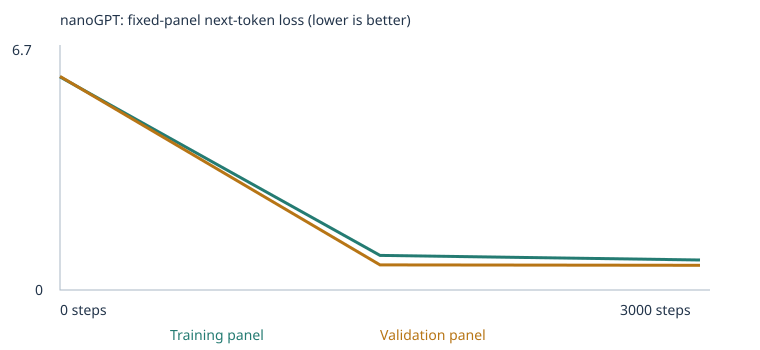
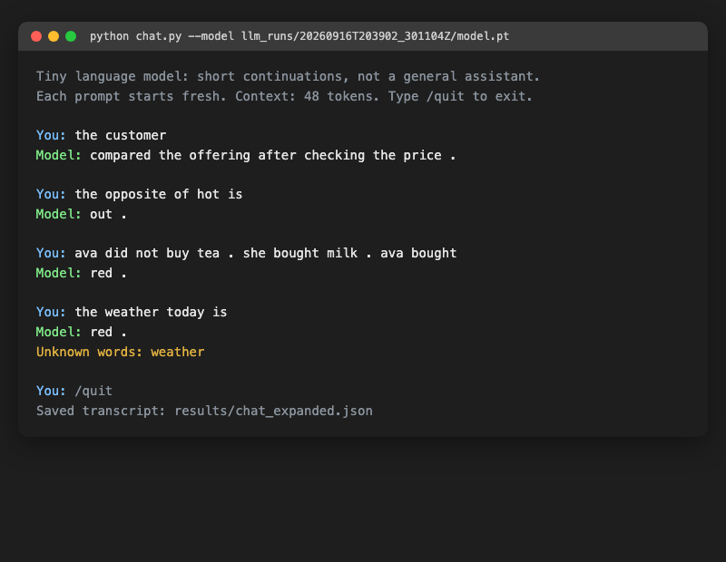

# My Custom LLM Experiment

This is my Class 4 assignment for *From Zero to AI Agents*. I trained Karpathy's real
nanoGPT transformer from scratch on a small word corpus. I tested it with a fixed
48-question language test before and after training, then I added more training text
and tested it again. I also talked to the trained model with a chat script. This
README is the main place to check my work — everything is linked here, so you don't
need to run the notebook again to see the results.

**I ran two experiments, and both finished successfully:**

| | Notebook | Evidence folder | Results ZIP |
|---|---|---|---|
| **Starter** (classroom corpus only) | [evidence/custom_llm_starter.ipynb](evidence/custom_llm_starter.ipynb) | [evidence/starter/](evidence/starter/) | [evidence/starter_results.zip](evidence/starter_results.zip) |
| **Expanded** (classroom corpus + 4 extra categories) | [evidence/custom_llm_expanded.ipynb](evidence/custom_llm_expanded.ipynb) / [custom_llm.ipynb](custom_llm.ipynb) (same file, in the repo root) | [evidence/expanded/](evidence/expanded/) | [evidence/expanded_results.zip](evidence/expanded_results.zip) |

Other important files: [evals/language_evals.json](evals/language_evals.json) is the
fixed 48-question test (I did not change it). [run_evals.py](run_evals.py) is the
script that scores the answers, and I can also run it by itself. [chat.py](chat.py)
is the terminal chat script, and [evidence/chat/](evidence/chat/) has real proof that
I chatted with the model. [ASSIGNMENT.md](ASSIGNMENT.md) is the assignment text.
[EXPERIMENTS.md](EXPERIMENTS.md) is extra work I did before this eval system existed
(more training steps and a bigger model) — the old, single-experiment version of my
submission is saved at [archive_pre_eval_run/](archive_pre_eval_run/) so I didn't
just delete it.

## My three choices (same for both experiments)

| Choice | Value | Why |
|---|---|---|
| Training steps | `TRAINING_STEPS = 3000` | This is what the assignment suggests to start with. A quick 10-step test first showed me the code works and runs in seconds on my laptop's CPU. |
| Learning rate | `LEARNING_RATE = 0.001` | The suggested default. The notebook also uses warmup and cosine decay. If the learning rate is too big the loss can jump around and never settle down. If it's too small the model barely learns anything in only 3,000 steps. |
| Corpus | `CORPUS = "classroom"` in both — **starter**: nothing added to `corpus/`; **expanded**: I added 5 files (see below) | I kept steps and learning rate the same in both runs on purpose, so the corpus is the only thing that changes. That way the comparison is fair. |

## Where my corpus text came from

**Starter run:** just the sentences the notebook already generates. I didn't add
anything, so there is nothing to worry about for permissions.

**Expanded run:** I wrote 5 small text files myself. Everything in them is made up by
me, not copied from anywhere. They live in `corpus/`, which is ignored by git (the
assignment sets it up that way), so the files themselves aren't in this repo — but
all the text is fully visible inside `evidence/expanded/corpus.txt` and
`corpus_manifest.json`, so nothing is hidden:

| File | Lines | Unique passages added |
|---|---|---|
| `extension_opposites.txt` | 160 | 160 |
| `extension_negation.txt` | 43 | 87 (some lines repeat, so after removing duplicates it's actually more unique passages) |
| `extension_everyday_knowledge.txt` | 17 | 17 |
| `extension_categories_and_analogies.txt` | 30 | 30 |
| `extension_vocab_filler.txt` | 12 | 12 |
| **Total** | **262 lines** | **306 new unique passages** |

I didn't use any PDFs, only plain `.txt` files, so there were no extraction warnings
to check. `corpus_manifest.json` shows 0 ignored files and 0 warnings in both runs.

## Why I picked these four extra categories

The test has 24 questions (called `extend_corpus`) split into 8 skills, 3 questions
each: grammar, opposites, negation, reference, sequence, spatial_relations,
everyday_knowledge, and categories_and_analogies. None of these skills exist in the
starter corpus at all. I picked **opposites, negation, everyday_knowledge, and
categories_and_analogies** (the assignment only asked for 2, so I did double that)
because I could teach them with short, simple sentences. The other four
(grammar, reference, sequence, spatial_relations) need longer stories with names and
events, which felt harder to do well in the time I had, so I left those alone.

**It took me three tries to actually make this work, and honestly this is the part
I learned the most from:**

1. **My first try:** I taught the four ideas but used completely different words than
   the test, on purpose, so I wouldn't accidentally copy the test (I used "sparrow"
   instead of "robin", "umbrellas" instead of "umbrella", and so on). Result: all 24
   `extend_corpus` questions stayed `out_of_vocabulary` — 0% coverage, nothing to even
   measure. I learned that this kind of small model, which only understands whole
   words and nothing smaller, cannot connect two different words that mean similar
   things. If I teach the idea with different words, the model learns nothing useful
   for that exact test.
2. **My second try:** I used the test's own words this time, but in new sentences the
   model had never seen. Still 0% coverage! The reason is that `run_evals.py` only
   scores a question if **all four** answer choices are words the model knows — not
   just the correct answer. I had only taught the correct answers, not the three
   wrong ones (words like "heavy", "loud", "yellow", "pillow").
3. **My final version** (this is what's actually in `corpus/` now): I added one more
   file, `extension_vocab_filler.txt`, with sentences covering every leftover wrong
   answer word. I also noticed a few words (`tree`, `carrot`, `asleep`, `metal`) only
   appeared once in my text, and by bad luck they landed in the 10% validation split
   and never made it into training — so I added a couple more sentences with those
   words too. After this, coverage reached 33 out of 48 questions (68.75%), and the
   12 questions in my 4 chosen categories could finally be properly tested.

Before every training run, I checked with a small script that none of my sentences
copy the exact test questions. The notebook itself also checks this automatically
(`eval_separation.json`, `reject_eval_leakage`) and would stop with an error if it
found a problem. Neither run had any leakage.

## How I made sure the test stays separate from training

- [evidence/starter/eval_separation.json](evidence/starter/eval_separation.json) and
  [evidence/expanded/eval_separation.json](evidence/expanded/eval_separation.json)
  both show **160 excluded passages** — these are classroom sentences that happened
  to contain a test question by accident, and the notebook removed them automatically
  before splitting the data. This covers all 16 `starter_patterns` question IDs, in
  both runs.
- The notebook's own `validate_corpus_location` and `reject_eval_leakage` functions
  run every time I hit Run All, and they would stop the whole run with an error if
  any of my files, or the final corpus, contained an exact test question. Both of my
  runs finished with no such error.
- On top of that, I wrote my own small leakage checker (using the same logic as
  `run_evals.py`) and ran it on every extension file before each training run. Zero
  matches every time — I show the full story of my three attempts in the "My
  prediction" cell of [custom_llm.ipynb](custom_llm.ipynb).

## What I predicted vs. what really happened

I wrote a prediction before each run, inside that run's "My prediction" cell in the
notebook (linked above). Short version:

- **Starter run:** I predicted `starter_patterns` would go well above the 25% random
  baseline, and `extend_corpus` would stay near 0% and mostly unknown-vocabulary.
  **What happened:** `starter_patterns` went from 37.5% to **100%**,
  `starter_transfer` went from 37.5% to 50%, and `extend_corpus` stayed at
  **0.0%** the whole time (all 24 questions out of vocabulary) — basically exactly
  what I expected.
- **Expanded run (final version):** I predicted `extend_corpus` coverage would reach
  around 12 out of 24 questions, with scores clearly above the 25% random baseline
  for the categories I taught. **What happened:** coverage reached **11 out of 24**
  (one more category, `opposites`, ended up fully testable too, so 35/48 overall).
  The scores were a real mix: `negation` and `everyday_knowledge` both jumped to
  66.7%, `categories_and_analogies` reached 33.3%, but `opposites` actually went
  *down* to **0%** after training (it got lucky with 1 out of 3 before training, on
  the one question that happened to be testable at that point) even though every
  word in it was known. That surprised me and I explain it more below.

## My two runs, side by side

| | Starter | Expanded |
|---|---|---|
| Completed steps | 3,000 / 3,000 | 3,000 / 3,000 |
| Time it took | 9.48s | 9.79s |
| Hardware | Apple Silicon Mac, macOS, CPU only, no GPU | same |
| Software | Python 3.13.15, PyTorch 2.14.0 | same |
| Parameters | 111,872 | 132,032 (bigger because the vocabulary table is bigger) |
| Vocabulary size | 136 words | 451 words |
| Train / validation documents | 4,132 / 460 | 4,408 / 490 |
| Unknown-word rate (train / val) | 0.00% / 0.00% | 0.00% / 0.16% |

Both runs use the same random seed (42) and the same settings, so the time and
hardware are almost the same — only the vocabulary and parameter count changed,
because of the extra text I added. One thing to be careful about: **the loss numbers
from the two runs cannot be compared directly**, because a bigger vocabulary makes
random guessing itself already harder. Guessing randomly over 136 words gives a loss
of about 4.91 (that's `ln(136)`), but over 451 words it's about 6.11 — and that is
almost exactly what both runs show at step 0 (4.93 and 6.10).

## Evidence: loss charts and generated samples

**Starter run** ([evidence/starter/training_curves.svg](evidence/starter/training_curves.svg)):


| Step | Train loss | Validation loss |
|---|---|---|
| 0 | 4.9263 | 4.9275 |
| 1500 | 0.6821 | 0.7182 |
| 3000 | 0.6783 | 0.7061 |

**Expanded run** ([evidence/expanded/training_curves.svg](evidence/expanded/training_curves.svg)):



| Step | Train loss | Validation loss |
|---|---|---|
| 0 | 6.0984 | 6.1134 |
| 1500 | 0.9899 | 0.7184 |
| 3000 | 0.8573 | 0.7061 |

Both loss numbers come from a fixed small group of documents (up to 20 for training,
up to 20 for validation) — they are small samples, not a measure over the whole
corpus.

**Generated text samples** (full files in
[evidence/starter/samples/](evidence/starter/samples/) and
[evidence/expanded/samples/](evidence/expanded/samples/)), same settings every time
(temperature 0.8, same seed):

- **Before training (step 0), both runs:** just random words with no grammar, like
  *"pear professor bond doctor course harvest team physician journey checking buyer
  delivery..."*
- **Halfway and at the end (both runs):** real sentences that follow the corpus's
  patterns, like *"the consumer compared the merchandise after checking the price ."*
  or *"our school has a question about the new educator and lesson ."* Most of the
  change happens between step 0 and step 1500 — from step 1500 to 3000 the text
  barely changes anymore in either run, even though the expanded run's loss is still
  moving during that time (train loss goes from 0.99 to 0.86). I think this means the
  model is still adjusting to fit the bigger vocabulary, even after the small sample
  set stopped changing.

## Following one word: token, embedding, gradient, and update

Here I follow the word **`customer`** through the starter run
([evidence/starter/inspection.json](evidence/starter/inspection.json),
[tokenization.json](evidence/starter/tokenization.json)):

- Word → ID: `customer` becomes **id 28** in the starter's 136-word vocabulary.
  (In the expanded run it's **id 92** instead — the vocabulary is sorted
  alphabetically, and with 451 words now instead of 136, every ID shifted.)
- Its embedding (a list of 64 numbers) **before** training, first 5 numbers:
  `[-0.0576, -0.0048, 0.0426, 0.0193, 0.0156]` — this starts out random.
- Its embedding **after** 3,000 steps: `[0.0366, -0.0182, 0.1330, 0.1060, 0.0630]` —
  now it means something, since training changed it.
- The very first weight update, for just one number in that embedding (position 0):
  it started at `-0.057592`, the gradient was `0.000693`, the learning rate was still
  tiny (`1e-05`, since warmup hadn't finished yet), and after the update it became
  `-0.057602`. A very small step, but it's a real one.
- What word comes after "the customer": before training, the model's best guess was
  just `customer` again, at only about 1.6% probability (basically a random guess out
  of 136 words). After training, it clearly prefers real verbs like `ordered`,
  `reviewed`, `recommended`, `selected`, `compared` — all of these actually make sense
  after "the customer ___".
- The words closest to `customer`'s trained embedding (measuring across all 64
  numbers, not just 2 or 3 of them): **client, buyer, subscriber, consumer,
  shopper** — and this is true in both runs. This group forms very early in training
  and doesn't change even after I added four unrelated new topics in the expanded run.

## Attention and temperature

The model can only look at itself and the words *before* it, never at words that come
later — this is called causal attention. Looking at "the customer", the first word
pays 100% attention to itself (there's nothing before it yet), and later words split
their attention across the earlier words, but never look forward. This is exactly
what makes it a left-to-right model.

Temperature controls how the model picks the next word during generation, without
changing anything it learned. A lower temperature (0.3) makes the model pick its
top choices more often, so the text is safer but more repetitive. A higher
temperature (1.2) makes it take more chances, so the text is more varied but also
less predictable. None of this changes any weight — `temperature_comparison.json` in
both evidence folders uses the exact same trained model for all three temperatures,
only the sampling changes.

## How the language test is scored

Each test question gives the model only the prompt — no answer choices, no correct
answer, nothing extra — and reads which of the 4 possible words the model thinks is
most likely to come next. If it picks the right one, that's a score of 1; wrong or
tied is 0. If the prompt or **any of the 4 answer choices** uses a word the model
never learned, the question is marked `out_of_vocabulary` and counts as 0 in the main
score (but it's kept separate in a "scorable accuracy" number, so it doesn't quietly
disappear). The model also writes a free, unguided continuation for every question,
which is saved but never used for scoring — it's just there so I can look at it. Full
details are in [evals/README.md](evals/README.md).

## Comparing all four test results (starter + expanded, before + after training)

All four full result sets are here:
[evidence/starter/language_evals/untrained/](evidence/starter/language_evals/untrained/) ·
[evidence/starter/language_evals/final/](evidence/starter/language_evals/final/) ·
[evidence/expanded/language_evals/untrained/](evidence/expanded/language_evals/untrained/) ·
[evidence/expanded/language_evals/final/](evidence/expanded/language_evals/final/)
(each one has `eval_cases.json`, `eval_results.json`, `eval_results.csv`, and
`eval_summary.json`). Short summaries are also in
[evidence/starter/language_eval_comparison.json](evidence/starter/language_eval_comparison.json)
and [evidence/expanded/language_eval_comparison.json](evidence/expanded/language_eval_comparison.json).

| Run / stage | Overall score | Score on scorable questions | Coverage | `starter_patterns` | `starter_transfer` | `extend_corpus` |
|---|---|---|---|---|---|---|
| Starter, before training | 18.75% (9/48) | 37.5% | 50.0% | 37.5% | 37.5% | 0.0% |
| Starter, after training | 41.67% (20/48) | 83.3% | 50.0% | **100%** | 50.0% | 0.0% |
| Expanded, before training | 18.75% (9/48) | 25.7% | 72.9% | 25.0% | 50.0% | 4.2% |
| Expanded, after training | **60.42%** (29/48) | 82.9% | 72.9% | **100%** | **100%** | **20.8%** |

Here's the breakdown just for the 24 `extend_corpus` questions in the expanded run,
after training (before training, every category was at 0%, except `opposites` which
got lucky at 33% on the one question it could even attempt):

| Category | Before training | After training | Coverage | What I noticed |
|---|---|---|---|---|
| opposites | 33.3% (1/3, and only 1 of 3 could even be tested yet) | **0%** (0/3, but now all 3 can be tested) | 100% | Training actually made this *worse*, not better — see below |
| negation | 0% | **66.7%** (2/3) | 100% | My best real result |
| everyday_knowledge | 0% | **66.7%** (2/3) | 100% | My second-best result |
| categories_and_analogies | 0% | **33.3%** (1/3) | 66.7% | 1 question still unknown-vocabulary |
| grammar | 0% | 0% | 0% (I didn't touch this) | As expected, since I never taught it |
| reference | 0% | 0% | 0% (I didn't touch this) | Not attempted |
| sequence | 0% | 0% | 0% (I didn't touch this) | Not attempted |
| spatial_relations | 0% | 0% | 0% (I didn't touch this) | Not attempted |

**Did adding more corpus text actually help?** Yes, but only partly, and not evenly.
`negation` and `everyday_knowledge` got a lot better — they went from impossible (0%
because nothing was even in the vocabulary) to clearly above the 25% random baseline.
`categories_and_analogies` improved a little. `opposites` is the strange one: every
word it needed was in the vocabulary, and I had taught both the sentence pattern
("the opposite of X is Y", using other word pairs) and the actual word pairs the test
uses (hot/cold, empty/full, noisy/quiet, but taught in different, simpler sentences)
— and it still scored 0 out of 3. My best guess is that the model could not put the
pattern and the word pairs together on its own, since it never saw them combined in
training, even though it had each piece separately. This is a real weakness, not a
bug in my code — I can see that because `starter_patterns` and `starter_transfer`,
which test patterns the model *did* see combined during training, both hit 100%. The
four categories I never touched stayed exactly where they were before — which matches
what the assignment says: more training steps cannot teach the model words or
patterns it was never shown.

## Actual free continuations (not the scored part)

Every test question also gets a free, unguided piece of generated text (24 tokens,
never scored, just saved for me to look at). This is different from the
multiple-choice score, and sometimes they disagree — here are 4 real examples,
taken straight from `eval_results.json` in each stage:

| Question | Prompt | Stage | Multiple-choice score | Free continuation (unscored) |
|---|---|---|---|---|
| `lang_01` (starter_patterns) | "the report about the customer explains the" | expanded, before training | wrong | *"looked patch patch banana lesson it tall between code so shared yellow stay..."* (word salad) |
| `lang_01` (starter_patterns) | "the report about the customer explains the" | expanded, after training | **correct** | *"purchase in detail ."* (matches the score — makes sense) |
| `lang_31` (negation) | "the box is not red . it is blue . the box is" | expanded, after training | **correct** | *"."* (empty/near-empty — the score says correct, but the free text says almost nothing) |
| `lang_43` (everyday_knowledge) | "water freezes into" | expanded, after training | wrong | *"a question about the steam at noticed ."* (grabs "steam", a related word, but still wrong and not fluent) |

`lang_31` is the clearest example of why the assignment keeps these two things
separate: the model picked the right word out of 4 choices (`blue`), which counts as
a correct score — but when I let it freely generate text instead of forcing a choice,
it produced almost nothing useful. Getting a multiple-choice question right does not
mean the model can actually write a good sentence about it.

## Chat interface

**How to run it yourself:**
```
source .venv/bin/activate   # first set it up: python3 -m venv .venv && pip install -r requirements.txt
python chat.py --model evidence/expanded/model.pt --transcript results/my-chat.json
```
Type anything, and type `/quit` when you're done. Every new prompt starts completely
fresh — the model has no memory between messages, and chatting never changes its
weights. You can load either `evidence/starter/model.pt` or
`evidence/expanded/model.pt` the same way, to try both trained models.

**Proof that I actually talked to it** (model used: `evidence/expanded/model.pt`,
run `20260916T203902_301104Z`, model hash
`d2903c78c64a59df9d8c897d562dee45bf038b1e285bf2ce59f36d173d5fa092`):



Full transcript: [evidence/chat/chat_expanded.json](evidence/chat/chat_expanded.json)
(4 real messages). I also did 2 quick messages against the older *starter* model for
comparison, saved in
[evidence/chat/chat_starter.json](evidence/chat/chat_starter.json) — interestingly,
the starter model just replies `[empty response]` and says "hot" and "opposite" are
unknown words, for the exact same message the expanded model can at least try to
answer.

**One real failure I can point to:** when I typed `"the weather today is"`, the
expanded model replied `red .` and told me `weather` was an unknown word. The model
never learned anything about weather in either corpus, so instead of saying it
doesn't know, it just grabs a common word from something unrelated it did learn (a
color word, from the negation sentences). Similarly, `"the opposite of hot is"`
returns `out .`, not `cold` — matching what the eval also showed: the model knows the
sentence *shape* and it knows the word *pair*, but putting them together correctly,
live, while generating text, is something it still fails at.

## What I learned

1. **Corpus and the held-out split:** the starter corpus teaches a narrow set of
   business/retail sentence patterns, and my extension adds four more narrow topics
   the same way. The held-out validation data only checks if the model can handle new
   *combinations* of the same patterns — it does not check if the model can handle a
   totally new topic. That's exactly the harder thing the `extend_corpus` questions
   are testing.
2. **Token vs. ID vs. embedding:** a token is just a piece of text (a word or a
   punctuation mark). An ID is just its position number in the vocabulary list —
   `customer` is 28 in one vocabulary and 92 in another, and the number itself has no
   meaning by itself. An embedding is the actual list of 64 numbers the network
   learns for that ID — random at the start, and meaningful after training.
3. **Loss, gradient, and weight updates:** the loss measures how surprised the model
   is by the real next word. Backpropagation calculates a gradient for every single
   parameter (around 112K to 132K of them here). Then AdamW uses that gradient to
   move each parameter a tiny bit. Different vocabulary sizes give a different
   starting loss just from random guessing (`ln(vocab_size)`), which is why I can't
   directly compare the loss numbers between my two runs — that's also why
   `config.json` records the exact vocabulary size for each run.
4. **Attention and temperature:** attention only looks backward, never forward.
   Temperature only changes how text is sampled when generating — it never touches
   any learned weight.
5. **The leakage check only catches exact matches, not the spirit of the rule:**
   `reject_eval_leakage` looks for the exact same words in the exact same order as a
   test question — it does not understand meaning, so I had to be careful myself too.
   For example, I avoided writing "a puppy grows into a dog" word-for-word, even
   though a slightly different sentence would have technically passed the automatic
   check.
6. **A question needs every answer choice known, not just the right one:** I didn't
   expect this at first — a question only counts if the model knows all 4 possible
   answers, not just the correct one. Teaching only the correct-answer words is not
   enough.
7. **Knowing a pattern and knowing a fact are not the same as knowing how to combine
   them:** `opposites` had every word it needed, and I had taught the sentence
   pattern separately and the word pairs separately — and it still failed every
   single time. To me, this is the clearest proof in this whole project that this
   tiny model is matching patterns it has seen, not actually reasoning.

## One limitation and my next experiment idea

**The limitation:** `opposites` is my clearest failure. Full vocabulary, a taught
sentence pattern, taught word pairs, and still 0 out of 3 correct — both on the test
and when I chatted with it directly (`"the opposite of hot is"` → `out .`). This
shows me that just having the right words in the vocabulary is not enough for the
model to actually answer correctly.

**What I would try next:** instead of teaching the pattern and the word pairs in
separate sentences like I did this time, I would teach some pairs *together*, in the
exact "the opposite of X is Y" phrasing the test uses — but only for word pairs the
test does *not* ask about (like wide/narrow or clean/dirty), while still keeping
hot/cold, empty/full, and noisy/quiet taught only indirectly, like before. I predict
this would make the general pattern more reliable, but I don't think it would fix the
`opposites` score by itself — I think the real problem is that the model needs to see
the pattern and a word pair *combined* many times before it can do that combination
on its own, and I only gave it a couple of data points to work with, not a cleaner
version of the same small amount of data.

## How to reproduce and check my work

1. Clone this repo, then run: `python3 -m venv .venv && source .venv/bin/activate && pip install -r requirements.txt` (this now also installs `numpy`, which `run_evals.py` needs for hashing the model, on top of the original `torch`/`pypdf`/`jupyter`).
2. **To redo the starter run:** make sure `corpus/` has no `extension_*.txt` files in it, then run `python build_notebook.py && jupyter nbconvert --to notebook --execute --inplace custom_llm.ipynb` (or just click Run All in Jupyter/Colab). Both of my runs use seed 42, so they are fully repeatable — I actually reran the starter experiment myself and got byte-for-byte identical `history.json` and `language_eval_comparison.json` files.
3. **To redo the expanded run:** put the 5 `extension_*.txt` files into `corpus/` (you can rebuild their exact content from `evidence/expanded/corpus.txt` / `corpus_manifest.json`, or just ask me for my generator script), then Run All again. Each run makes a new `llm_runs/` folder.
4. **To just rerun the test** on a saved model: `python run_evals.py --model evidence/starter/model.pt --output results/my-eval --stage final` (swap in `evidence/expanded/model.pt` for the other model; always use a new, empty `--output` folder).
5. **To chat:** `python chat.py --model evidence/expanded/model.pt --transcript results/my-chat.json`.
6. **Extra checks** (optional): `python -m unittest test_language_evals test_corpus`.
7. **Embedding viewer:** download `embedding-viewer.html` from this repo, open it in your browser locally, and load either `evidence/starter/checkpoint.json` or `evidence/expanded/checkpoint.json`.

Extra, not required: [EXPERIMENTS.md](EXPERIMENTS.md) has some earlier experiments I
did with more training steps and a bigger model, from before this eval system
existed. The full evidence for that earlier, single-experiment version of my
submission is kept at [archive_pre_eval_run/](archive_pre_eval_run/) — I didn't
delete it, just moved it aside.
