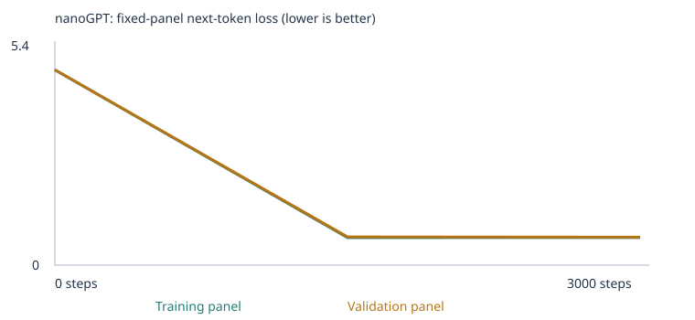

# My Custom LLM Experiment

Class 4 assignment for *From Zero to AI Agents* — training Karpathy's actual
nanoGPT transformer from scratch on a small word-token corpus, then inspecting
what the numbers show. This README is the grading entry point: it links every
piece of evidence so it can be reviewed without rerunning the notebook.

- **Executed notebook:** [custom_llm.ipynb](custom_llm.ipynb) (run end-to-end, all outputs visible — open on GitHub to inspect without downloading)
- **Starter project / assignment source:** [pepealonso95/custom-llm](https://github.com/pepealonso95/custom-llm), [ASSIGNMENT.md](ASSIGNMENT.md)
- **Evidence folder:** [evidence/](evidence/) — the full results directory saved by the notebook's final run, plus [evidence_results.zip](evidence_results.zip) (the same folder zipped)
- **Extended experiments (optional, requested by my professor):** [EXPERIMENTS.md](EXPERIMENTS.md) — more training steps (5k/20k/100k) and a 7x bigger model, testing whether the model actually gets "smarter." Doesn't replace anything required above.

## My choices and prediction

| Choice | Value | Reason |
|---|---|---|
| Corpus | `CORPUS = "classroom"` | Only the notebook's built-in synthetic teaching sentences — no external files, so no data-permission concerns. |
| Training steps | `TRAINING_STEPS = 3000` | The assignment's suggested starting budget, after a 10-step setup run confirmed the environment worked (finished in ~5s). |
| Learning rate | `LEARNING_RATE = 0.001` | The suggested default, with warmup + cosine decay handled inside the training cell. Too large risks the loss diverging/oscillating past the minimum; too small barely moves the weights in 3,000 steps. |

I used the supplied synthetic classroom corpus only (no files added to `corpus/`), so there's no
external source to attribute permission for — see [evidence/corpus_manifest.json](evidence/corpus_manifest.json)
(`external_passages: 0`, `mode: "classroom"`).

**My prediction, written before training** (also in the notebook's "My prediction" cell):
validation loss would drop quickly from ~4.9 (random guessing over the vocabulary) and flatten
somewhere around 0.7–1.5 by step 3,000, since the corpus repeats a small set of sentence
templates; generated text would go from word salad to grammatical-but-narrow template sentences;
and the word `customer` would end up with neighbors like `client`, `buyer`, `shopper`, `consumer`,
since the corpus repeats patterns like "compared the X with another X" across retail nouns.

**What I actually observed:** loss landed at 0.696 (train) / 0.706 (validation) — right at the
low end of my range, and train/validation tracked closely rather than diverging. Samples went
from word salad at step 0 to grammatical template sentences by step 1,500–3,000, exactly as
predicted. `customer`'s measured nearest neighbors are `client` (cosine 0.985), `buyer` (0.981),
`subscriber` (0.980), `consumer` (0.979), `shopper` (0.978) — matching my prediction almost word
for word.

## My run

- Completed steps: **3,000 / 3,000** (not interrupted) — [evidence/training_summary.json](evidence/training_summary.json)
- Elapsed time: **9.72 seconds** of training compute (full notebook, setup through save, ran in ~17s)
- Hardware: Apple Silicon Mac, `macOS-15.7.4-arm64-arm-64bit-Mach-O`, CPU only (no GPU used) — [evidence/config.json](evidence/config.json)
- Software: Python 3.13.15, PyTorch 2.14.0
- Parameter count: **111,872** (2 blocks, 4 heads, 64-dim embeddings, 48-token context — the classroom nanoGPT config)
- Vocabulary size: **136** tokens (133 retained word/punctuation types + `<UNK>`, `<BOS>`, `<EOS>`)
- Documents: 4,632 unique deduplicated passages (6,360 raw − 1,728 duplicates) → **4,168 train / 464 validation** (90/10 split)
- Unknown-token rate: **0.00%** on both training and held-out text — [evidence/vocabulary_report.json](evidence/vocabulary_report.json)

The 509-type vocabulary cap was never binding here (only 133 distinct types existed in this
synthetic corpus, all retained), so nothing became `<UNK>` — the classroom corpus is
intentionally small and repetitive. The split is by deduplicated *passage*, not by source file;
since every passage here is a synthetic single-sentence template, this evaluation tests whether
the model generalizes to new combinations of the same templates, not to unseen writing styles.

## My evidence

**Loss curve** ([evidence/training_curves.svg](evidence/training_curves.svg)):

**Full measured loss table** (fixed panels of 20 training + 20 validation documents each,
averaged over non-padding next-token targets — [evidence/history.json](evidence/history.json)):

| Step | Training panel loss | Validation panel loss |
|---|---|---|
| 0 | 4.9238 | 4.9247 |
| 1500 | 0.6929 | 0.7113 |
| 3000 | 0.6956 | 0.7057 |

**Samples at three checkpoints, same generation settings** (full files in [evidence/samples/](evidence/samples/)):

- **Untrained (step 0):** `pear professor bond doctor course harvest team physician journey checking buyer delivery traffic report the lecturer item offering and system <UNK> taste recommended mentioned bus question customer at mortgage nurse in instructor` — pure word salad, no grammar.
- **Halfway (step 1500):** `our school has a question about the new educator and lesson .` / `the consumer compared the merchandise after checking the price .` — grammatical template sentences.
- **Final (step 3000):** identical text to step 1500 for this run (`our school has a question about the new educator and lesson .`, `the consumer compared the merchandise after checking the price .`) — the model had already converged onto the same output by step 1500, and loss barely moved between 1500 and 3000 (0.6929→0.6956 train), so the visible change is between step 0 and step 1500, not between 1500 and 3000.

**Token → ID → embedding, gradient, and update** ([evidence/tokenization.json](evidence/tokenization.json), [evidence/inspection.json](evidence/inspection.json)):

- Word **`customer`** → token ID **28** in the vocabulary.
- Embedding **before** training (first 5 of 64 numbers): `[-0.0576, -0.0048, 0.0426, 0.0193, 0.0156]`
- Embedding **after** 3,000 steps (first 5 of 64): `[0.0371, -0.0048, 0.1358, 0.1226, 0.0716]`
- First saved parameter update (coordinate 0 of `customer`'s embedding, at the very first training step): `before = -0.057592`, `gradient = -0.00040561`, `learning_rate = 1e-05` (warmup hadn't ramped up yet), `after = -0.057582`.
- Next-token probabilities for the prefix **"the customer"**: before training, the top guess was `customer` itself at only **1.6%** (near-random over 136 tokens); after training, the top guesses were `ordered` (19.3%), `reviewed` (19.2%), `recommended` (17.7%), `selected` (17.2%), `compared` (13.6%) — all grammatically sensible continuations of "the customer ___".

**Temperature comparison**, same trained model and starting token, three temperatures
([evidence/temperature_comparison.json](evidence/temperature_comparison.json)):

| Temperature | Sample |
|---|---|
| 0.3 (sharper) | `our school has a question about the new educator and lesson .` |
| 0.8 (default) | `the report about the nurse explains the health in detail .` |
| 1.2 (flatter) | `the report about the nurse explains the health in detail .` |

## What I learned

1. **Corpus:** the classroom corpus is synthetic sentences that deliberately reuse a small set
   of templates (business, finance, food, transport, software, health, education) so related
   nouns fill the same slots. It can teach the model those templates and to place
   same-slot words near each other in embedding space; it can't teach real facts or reasoning.
   Data is held out (464 passages) so I can check the model isn't just memorizing the exact
   training passages — but since validation reuses the same templates, this only tests
   recombination within known patterns, not generalization to new domains.
2. **Token vs. ID vs. vector vs. embedding:** a *token* is a unit of text (here, a word or
   punctuation mark from `word_tokens`). A *token ID* is the arbitrary integer index of that
   token in the vocabulary list (`customer` → 28) — the number itself carries no meaning, it's
   just a lookup key. A *vector* is any ordered list of 64 numbers. An *embedding* is the specific
   vector the network has learned to associate with a given ID, stored in a lookup table
   (`wte`) that training updates — before training it's random noise, after training its
   position encodes which other words appear in similar contexts.
3. **What makes it a neural network, and how it learns:** the model is layered weighted sums
   (attention + MLP blocks) with GELU nonlinearities, residual connections, and LayerNorm,
   ending in a projection back to vocabulary-sized logits. Each training step: run a batch of
   documents through the network to get next-token probabilities → cross-entropy loss compares
   those probabilities to the actual next tokens → backpropagation computes the gradient of the
   loss with respect to every one of the 111,872 parameters → AdamW uses each gradient (scaled by
   its own learning-rate schedule and momentum/variance estimates) to nudge every parameter a
   small step. Repeated 3,000 times, loss fell from ~4.92 (random) to ~0.70.
4. **Attention and context:** causal self-attention lets each position combine information only
   from itself and *earlier* tokens — the measured attention rows show position 0 attending
   100% to itself (nothing precedes it) and later positions blending across earlier ones
   (e.g. `[0.585, 0.415, 0.0]`), never assigning any weight to future positions. That masking is
   what makes it a left-to-right causal language model rather than a bag-of-words model.
5. **Probabilities, generation, and temperature:** the network's final layer outputs one logit
   per vocabulary token; softmax turns those into a probability distribution; sampling from that
   distribution (repeatedly, feeding each new token back in) produces text one word at a time.
   Temperature divides the logits before the softmax: lower temperature (0.3) sharpens the
   distribution toward the already-most-likely tokens (more repetitive), higher temperature (1.2)
   flattens it (more varied, less certain). None of the three temperature runs touch any weight —
   `temperature_comparison.json` reuses the exact same trained `model.pt` for all three; only the
   sampling step changes.
6. **Did the evidence support my prediction?** Yes, closely: measured final loss (0.696/0.706)
   landed at the low end of my predicted 0.7–1.5 range, samples turned from gibberish into
   grammatical template sentences as predicted, and `customer`'s actual nearest neighbors
   (client, buyer, subscriber, consumer, shopper) matched my prediction almost exactly. What I
   can honestly conclude: the model learned the statistical shape of this narrow, repetitive
   corpus very well, and its "understanding" of words like `customer` is entirely a byproduct of
   which other words share its sentence slots — not evidence of broader semantic knowledge.

## One limitation and my next experiment

**Limitation:** validation loss essentially matched training loss (0.706 vs. 0.696) and samples
stopped changing between step 1,500 and step 3,000 — the model converged almost immediately
because the corpus only contains ~7 sentence templates over a 133-word vocabulary. This means the
loss curve and "held-out" evaluation can't distinguish memorization from generalization here;
the model may simply be able to reproduce every template it's seen, and the held-out passages
are new fills of the same templates, not a real test of unseen material.

**Next experiment:** add my own permitted text files (e.g. personal class notes) into `corpus/`
with `CORPUS = "classroom"` and rerun. I'd predict the unknown-token rate stays low if the added
text overlaps the existing vocabulary, but validation loss should rise and samples should look
less repetitive, since a more naturalistic, less templated corpus is harder for a two-block,
111K-parameter model to fully memorize in 3,000 steps.

**Update — a different next experiment, actually run:** before I got to the corpus experiment
above, my professor asked me to instead try more training steps and a bigger model, to see how
much "smarter" the model gets. See [EXPERIMENTS.md](EXPERIMENTS.md): it doesn't get smarter past
about 20,000 steps (validation loss gets *worse* by 100,000 — overfitting), and a 7.3x bigger
model plateaus at the same loss as this baseline, confirming the real bottleneck is this narrow
corpus, not steps or parameters — which is exactly what motivated the corpus experiment above.

## Reproduce and inspect

1. Clone this repo, then either:
   - **Locally:** `python3 -m venv .venv && source .venv/bin/activate && pip install -r requirements.txt`, then open [custom_llm.ipynb](custom_llm.ipynb) with that environment, or run `python custom_llm.py` directly.
   - **Colab:** open [custom_llm.ipynb](custom_llm.ipynb) on GitHub and click "Open in Colab" (default CPU runtime is enough).
2. Section 1 of the notebook holds the three settings (`CORPUS`, `TRAINING_STEPS`, `LEARNING_RATE`) — already set to the values used in this run. Run All to reproduce; the run is seeded, so it should reproduce these exact numbers.
3. All evidence referenced above lives in [evidence/](evidence/) (unzipped) and [evidence_results.zip](evidence_results.zip) (zipped) — no corpus files were added beyond the notebook's built-in synthetic sentences, so nothing here needs redaction.
4. To use the [embedding viewer](https://github.com/pepealonso95/custom-llm/blob/main/embedding-viewer.html), download it from the upstream repo, open it locally, and load [evidence/checkpoint.json](evidence/checkpoint.json).
